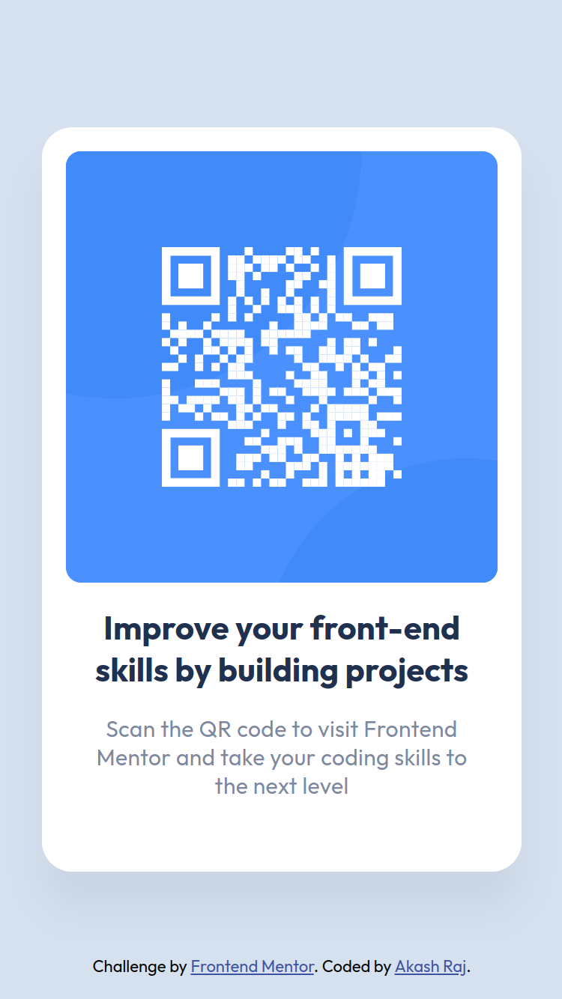
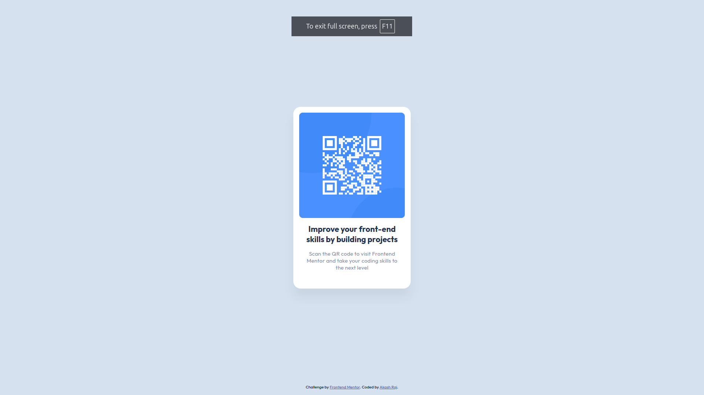

# Frontend Mentor - QR code component solution

This is a solution to the [QR code component challenge on Frontend Mentor](https://www.frontendmentor.io/challenges/qr-code-component-iux_sIO_H). Frontend Mentor challenges help you improve your coding skills by building realistic projects. 

## Table of contents

- [Overview](#overview)
  - [Screenshot](#screenshot)
  - [Links](#links)
- [My process](#my-process)
  - [Built with](#built-with)
  - [What I learned](#what-i-learned)
- [Author](#author)

## Overview

### Screenshot

### Links

- [Solution URL](https://github.com/akasr/frontendmentor/tree/main/development/newbie/qr-code-component)
- [Live Site URL](https://akasr.github.io/frontendmentor/development/newbie/qr-code-component/)

## My process
1. Setup the project - Dowload the starter files, create a local stylesheet, connect to google fonts and connect to figma extension to vs code
2. Design for mobile screens.
3. Design for desktop screens.

### Built with

- Semantic HTML5 markup
- CSS Variables
- Flexbox
- Mobile-first workflow

### What I learned

1. It is not possible to stack any element below the body element.
2. CSS variables

## Author

- Website - [Akash Raj](https://roshiv.notion.site)
- Frontend Mentor - [@akasr](https://www.frontendmentor.io/profile/akasr)
